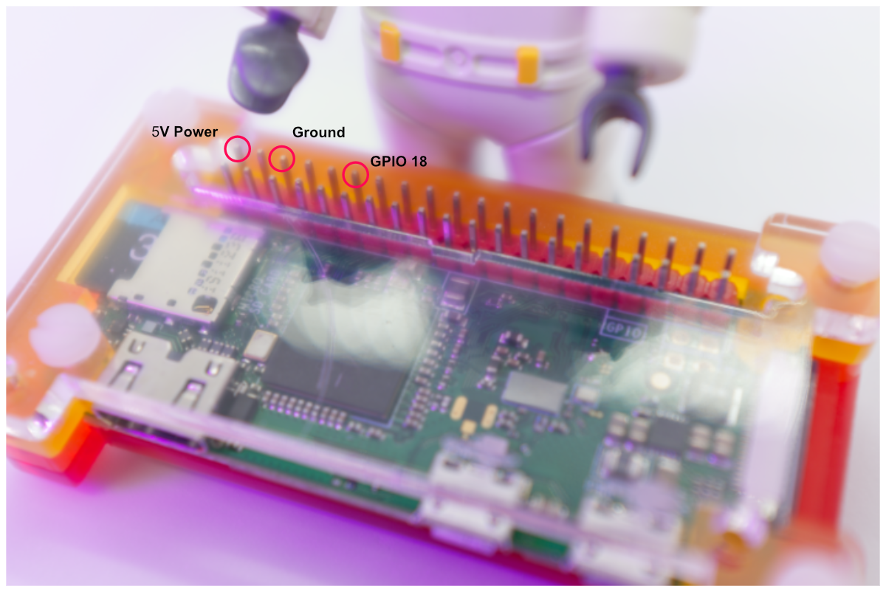
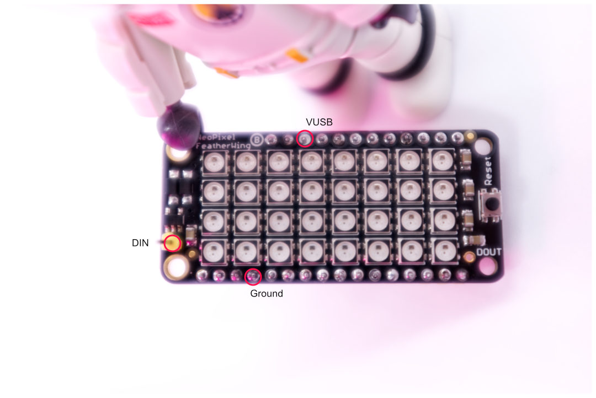

# Raspberry Pi Zero W with NeoPixel FeatherWing


This is a mini guide on how to use Adafruit’s NeoPixel FeatherWing with a Raspberry Pi (Zero W in this case).


**Pinout and Wiring**


From the PI you will need GPIO 18, 5V Power and Ground



On the NeoPixel FeatherWing you need DIN, VUSB and Ground



 Connect the following pins:

	+ GPIO 18 to DIN
	+ 5V Power to  VUSB
	+ Ground to Ground


**And now, the code!**


We will be using Python to interact with the FeatherWing, so first you need to do is install the following libraries:

 + rpi-ws281x
 + adafruit-circuitpython-neopixel

Once that is done, go ahead and import _board_ and _neopixel_

```
	import board
	import neopixel
````

According to the documentation, to initialize a NeoPixel object we need to pass the following parameters to the NeoPixel() function:

+ **pin**: The pin that will output data to the FeatherWing
+ **n**: Number of LEDs in the NeoPixel (FeatherWing has 32)
+ **brightness** : Brightness of the LEDs (between 0.0 and 1.0)
+ **auto_write:** If this is set to True then the FeatherWing will immediately change when you set a new value, otherwise you will have to call the .show() function after each set
+ **pixel_order**:  This indicates the pixel color channel order , it’s set to GRBW by default but you can also change it to GRB, RGB or RGBW


```
	# FeatherWing Setup
	led_count = 32
	data_pin = board.D18
	led_brightness = 1  
	aw = False      
	color_order = neopixel.RGB

	# FeatherWing Initialization
	fw = neopixel.NeoPixel(data_pin, led_count, brightness = led_brightness, auto_write=False, pixel_order = color_order)
```


Now that our NeoPixel object has been initialized we can go ahead and start adding some colors.

You could either use the .fill() function to illuminate all the LEDs in the FeatherWing:

```
	color = (51, 204, 54) #RGB values of the color we want
	fw.fill(color)
	fw.show().	#We set auto_write to false, so we need to call .show() so changes take place
```


Or light up individual LEDs by referencing their positions:

```
	color = (51, 204, 54) #RGB values of the color we want
	fw[0] = color  # set our color into the first LED
	fw[1] = color  # set our color into the second LED
	fw[2] = color. # set our color into the third LED
	fw.show()
```

See _featherWingTest.py_ for a demo implementation of this mini guide.


> References
1. [Use NeoPixels with Raspberry Pi and Python — The MagPi magazine](https://magpi.raspberrypi.com/articles/neopixels-python)
2. [monthofmaking2019/rollcall.py at master · themagpimag/monthofmaking2019 · GitHub](https://github.com/themagpimag/monthofmaking2019/blob/master/DisplayLights/rollcall.py)
3. [Pinouts | Adafruit NeoPixel FeatherWing | Adafruit Learning System](https://learn.adafruit.com/adafruit-neopixel-featherwing/pinouts)
4. [Python Usage | NeoPixels on Raspberry Pi | Adafruit Learning System](https://learn.adafruit.com/neopixels-on-raspberry-pi/python-usage)
5. [adafruit-circuitpython-neopixel · PyPI](https://pypi.org/project/adafruit-circuitpython-neopixel/)
6. [Raspberry Pi GPIO Pinout](https://pinout.xyz/#)
7. [HTML Color Picker](https://www.w3schools.com/colors/colors_picker.asp)
